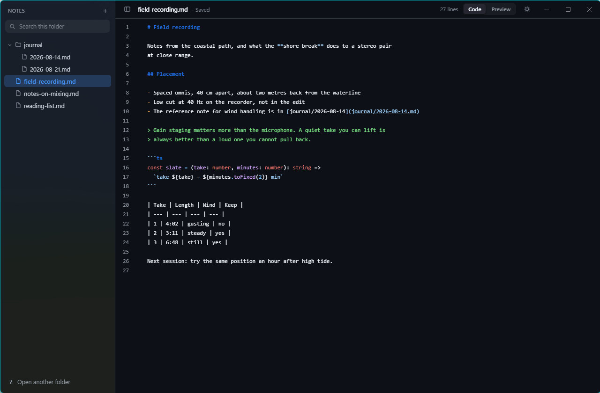
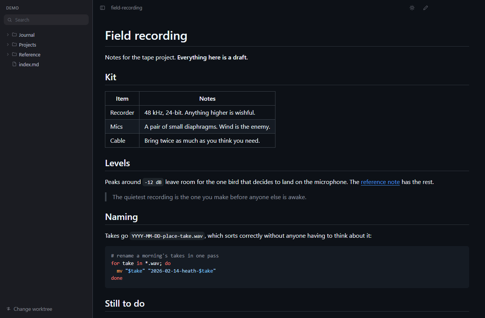
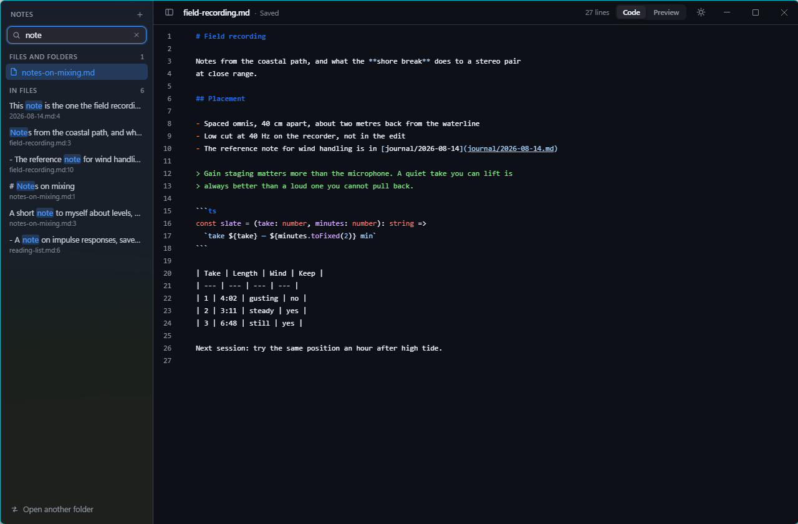
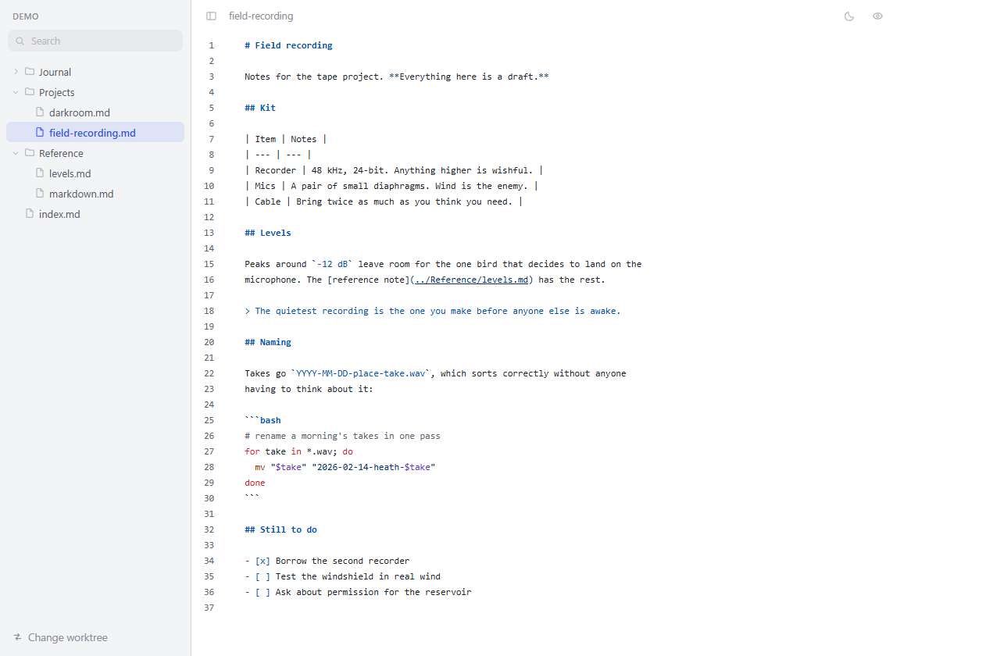

<div align="center">

# NanoMark

**A markdown editor that gets out of the way, and looks exactly like GitHub.**

Point it at a folder and that folder is the session. Write in a source view that
is GitHub's, press `Ctrl+E` and read the page GitHub would have rendered. It
saves by itself and never asks you anything.



</div>

---

# Part 1 — What it is

## One folder, and nothing else

NanoMark opens one **worktree** at a time — a folder you choose, the way
Obsidian opens a vault. The sidebar is that folder's markdown files, the search
covers that folder, and the app cannot read or write a single byte outside it.
`Open another folder` swaps it; the app reopens it next time you start.

That boundary is not a preference, it is the security model. Every path arriving
from the interface is resolved through its symlinks and checked against the open
worktree before anything touches the disk. A path that lands outside is refused,
not clamped.

**It never touches the network.** No accounts, no sync, no update check, no
telemetry, and no spellchecker reaching out for a dictionary. The packaged
build ships a Content-Security-Policy with `connect-src 'none'`, and the
window is built with the built-in spellchecker switched off, which is the only
part of Chromium that would have made a request on its own.

## Two views of the same file

The source view is GitHub's blob view: line numbers, 12px monospace on a 20px
grid, and the Primer syntax palette. `Ctrl+E` renders the file the way GitHub
renders it — the same headings with their rules underneath, the same code
blocks, the same tables.



The colours were not chosen. They were **sampled from a rendered markdown blob
on github.com**, in both colour schemes, and three of them are not what anyone
would have guessed:

- A list dash is **orange**, not the yellow the palette's `markup-list` token
  suggests.
- A blockquote — the `>` *and* the text — is the **entity-tag** colour: green in
  dark, blue in light.
- **Bold source text is not bold.** GitHub only colours the `**` markers; the
  words between them keep the default colour and weight. Headings are not
  enlarged either — blue and bold at the same 12px as everything else.

The rendered pane uses `github-markdown-css`, which is GitHub's own stylesheet.

## It saves itself, and it notices

There is no save button and no unsaved state to lose. Typing stops, and half a
second later the file is on disk. Switching files, leaving the window and
quitting each force the pending write out first — the window is held open until
the editor confirms it finished.

The header says so: `Saved` while that holds, `Saving…` while a write is out.
The other half of never being asked to save is being told when it did not work —
a read-only file, a full disk, a network drive that dropped. Then the header
says **`Not saved`** and stays saying it, keeping your text in hand and retrying
on a widening delay until a write lands.

Edit the same file in another program and NanoMark reloads it, and says it did.
If you have unsaved work it keeps your buffer instead and offers you both ways
out — reload from disk, or keep yours — rather than choosing for you.

A file that arrived with CRLF line endings leaves with CRLF, so a note kept in a
git repository does not turn into a whole-file diff the first time you touch it.

## Search that reads inside the files

One bar, three kinds of result at once: file names, folder names, and the text
inside every file in the worktree. A content hit shows the line with the match
highlighted and `file:line` underneath; opening one jumps the editor to that
line with the term selected.



It runs on every keystroke, so it is bounded on every axis: it caps results,
skips files over a megabyte, opens at most eight at a time, and waits for a
second character before it starts reading contents.

## Light or dark

The sun/moon button follows the system until you press it. The choice drives the
whole window — including the native backdrop, Mica on Windows and vibrancy on
macOS — and survives a restart. Right-click the button to hand control back to
the system.

| | |
| --- | --- |
| **dark** | **light** |
|  |  |

## Keyboard

| | |
| --- | --- |
| `F1` | the whole list, in the app — or the keyboard button in the header |
| `Shift+F1` | the markdown guide, built into the app |
| `Ctrl+E` | source or rendered |
| `Ctrl+F` | jump to the search bar |
| `Ctrl+B` | show or hide the sidebar |
| `Ctrl+N` | new file, next to the current one |
| `Ctrl+Shift+N` | new folder |
| `Ctrl+O` | open another folder |
| `Ctrl+S` | save now, though auto-save already has you covered |
| `F2` | rename the row the tree is on |
| `Delete` | move that row to the recycle bin, after asking |
| `↑ ↓` `→ ←` `enter` | walk the tree, unfold a folder, open a file |
| `↑ ↓` `enter` | walk the search results and open one |
| `esc` | clear the search |

The tree is a real tree to the keyboard: arrows walk it, `Shift+F10` opens the
row menu, and the menu prints every accelerator next to its command. On macOS
the same commands are in the menu bar.

The mouse gets the same menu from a right-click anywhere in the sidebar. On a
row it acts on that row — a folder, or the folder a file sits in. On the empty
space below the tree it acts on the worktree itself, so `New file` there writes
into the root. Either way a new file opens in the editor as soon as it exists.

Deleting goes to the recycle bin, through the shell, and asks first — naming the
file, or the folder and everything under it. Nothing here calls `unlink`.

---

## Get it

The current release is **0.3.0**, for Windows. Both files are on the
[releases page](https://github.com/yirasso/nano-mark/releases/latest).

| | |
| --- | --- |
| `NanoMark-0.3.0-setup.exe` | installs it, with a shortcut and an uninstaller |
| `NanoMark-0.3.0-portable.exe` | one file that keeps its session in a `NanoMark-data` folder beside itself and leaves nothing behind |

Neither is code-signed, so Windows SmartScreen will want a *More info → Run
anyway* the first time. Packaging is wired for Windows only — see
[Known limits](#known-limits).

---

# Part 2 — For developers

## Run it

```bash
npm install
npm run dev
```

That is the whole setup — no configuration, no services, no environment file.

`npm run build:win` produces two things: an installer, and a portable exe that
keeps its session in a `NanoMark-data` folder beside itself instead of in
`%APPDATA%`. electron-builder's portable target only means "one file, no
installer" — it still writes to `%APPDATA%` and shares that with an installed
copy, which is not what anyone means by portable. A stick moved to another
machine should carry its own state and leave nothing behind, so
`src/main/portable.ts` redirects `userData` before the single-instance lock is
taken, and falls back to the normal location if the folder cannot be written.

| Script | |
| ------ | --- |
| `npm run dev` | run with hot reload |
| `npm test` | Vitest |
| `npm run typecheck` | main, preload and renderer |
| `npm run build` | typecheck, then bundle into `out/` |
| `npm run build:win` | an NSIS installer and a portable exe, into `dist/` |
| `npm run icon` | regenerate `build/icon.ico` |

## Stack

| Layer | Choice | Why |
| ----- | ------ | --- |
| Shell | Electron 43 | contextIsolation, sandbox, no Node in the renderer |
| Build | electron-vite 5 + Vite 7 | one config for all three processes, with HMR |
| Language | TypeScript 7, strict | |
| Interface | React 19 | |
| Editor | CodeMirror 6 | incremental parsing, and a tag system worth re-tagging |
| Rendering | marked + DOMPurify + `github-markdown-css` | GitHub's own stylesheet |
| Highlighting | `highlight.js/lib/common`, loaded on first preview | a session that never leaves the editor never pays for it |
| Watching | chokidar | |
| Tests | Vitest, jsdom where a DOM is needed | |
| Packaging | electron-builder | NSIS + portable |

The packaged app has **one runtime dependency**, chokidar. Everything else is
bundled into the renderer rather than shipped a second time in `node_modules`.

The icon is generated, not drawn: `scripts/make-icon.mjs` rasterises it and
writes the PNG and ICO containers by hand, so there is no binary asset in the
repository that nobody can regenerate.

## Layout

```
src/
  main/           Electron main — the only process that may touch a disk
    index.ts      window, lifecycle, flush-before-close
    ipc.ts        every handler, in one place
    paths.ts      assertInsideWorktree — the security boundary
    files.ts      read / write / create / rename / trash
    fs-tree.ts    the tree, filtered and sorted
    search.ts     names and contents, bounded
    watcher.ts    chokidar, with self-write suppression
    store.ts      persisted session, and the migration from an older shape
    portable.ts   keeps a portable copy's session beside its executable
  preload/        the only bridge: contextBridge -> window.nano
  renderer/       React — sidebar, CodeMirror editor, rendered pane
    components/editor-theme.ts   the GitHub mapping
    styles/github.css            the sampled Primer tokens
  shared/         types and channel names, imported by all three
```

## The parts worth knowing

A handful of decisions look arbitrary until you know what went wrong without
them.

**The watcher has to recognise its own writes.** Auto-save writes the file, the
watcher sees a change, the app reloads what it just wrote, and the two chase
each other forever. Every write records the mtime it produced, and the watcher
drops events that match. There is a test for it.

**A jump to a search result waits for the right document.** The editor is one
long-lived `EditorView` whose state is swapped per file, and a file's content
arrives asynchronously after the path changes. Revealing a line as soon as the
path matches lands on an empty buffer, spends the request and never retries — so
`useDocument` exposes `loadedPath`, and the reveal waits for the content that
belongs to it.

**Markdown punctuation had to be split apart.** lezer-markdown files every
mark — `#`, `-`, `**`, backticks, brackets, `>` — under one
`processingInstruction` tag, and GitHub gives them four different colours. So
`editor-theme.ts` re-tags each mark through the markdown extension's `props`,
and the mark rules come last in the highlight style: a `**` inside a
`StrongEmphasis` carries both tags, and the later rule wins.

**The renderer is never trusted.** It has no `fs`, no Node, and no way to reach
one. Rendered HTML goes through DOMPurify, links open through the shell against
a protocol allowlist instead of navigating the window, and `will-navigate` and
`setWindowOpenHandler` both refuse.

## Testing

```bash
npm test
npm run typecheck
```

81 tests, weighted towards the places where being wrong is expensive rather than
towards coverage: path traversal and symlink escapes, the worktree boundary
moving when the worktree changes, CRLF survival, self-write suppression, the
sanitiser against `<script>`, `onerror=` and `javascript:` URLs, search bounds
and result ordering, the migration from the older multi-folder session, and the
colour every markdown construct resolves to in the editor.

That last one is worth a note. `editor-theme.test.ts` parses markdown, runs it
through the real highlight style, and asserts the resolved colour of each
construct — so if the GitHub mapping ever drifts it fails as a test, rather than
as a slightly-wrong-looking view.

## Known limits

- **The source view does not soft-wrap**, because GitHub's does not: long lines
  scroll sideways. Adding `EditorView.lineWrapping` back to the extension list
  in `Editor.tsx` is a one-line change.
- Only `.md`, `.markdown`, `.mdown` and `.mkd` appear in the tree.
- Packaging is wired for Windows. The macOS and Linux targets are configured but
  have not been built or tested.

---

## License

MIT — see [LICENSE](LICENSE).

Copyright © 2026 Tomas Girao.
